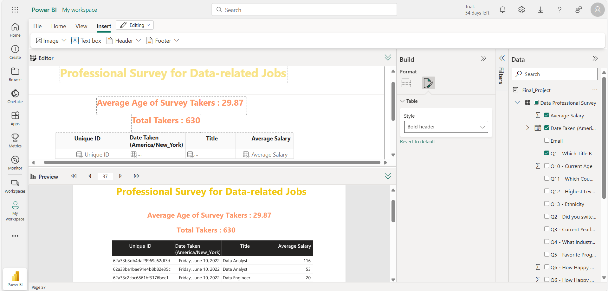
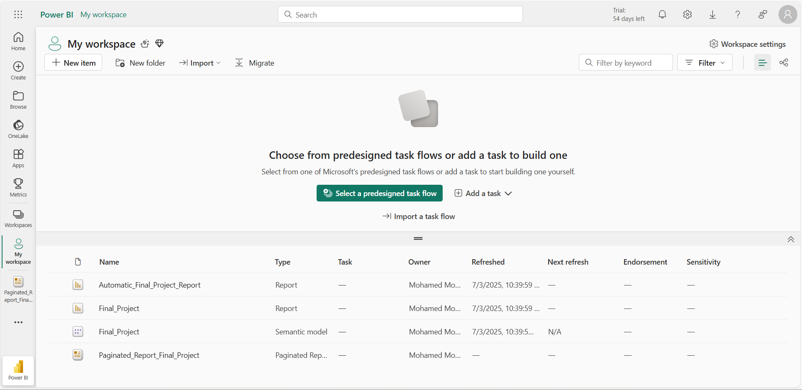
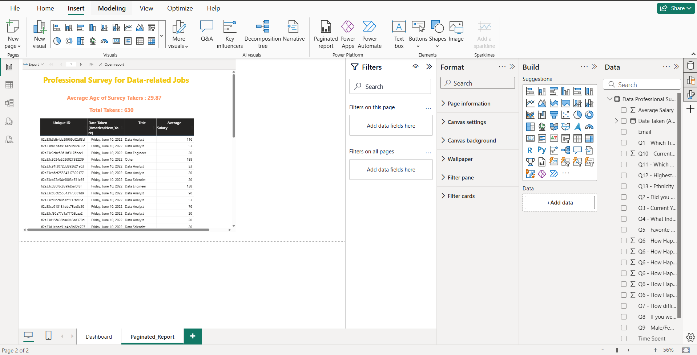

# Paginated-Report-Power-BI
This project leverages Microsoft Power BI to analyze a professional survey focused on individuals working in data-related roles. The goal is to provide visual insights into survey demographics, job titles, average salaries, and engagement trends over time.

🚀 Project Summary
1. Platform: Microsoft Power BI (Cloud Service)
 

2. Data Source: “Data Professional Survey” dataset
3. Tools Used: Reports, Paginated Reports, Semantic Models, and Dashboards
 

Purpose: To visualize and communicate insights from a structured survey dataset through dynamic, interactive dashboards.

🧩 Key Features
✅ Reports Created
1. Automatic Final Project Report

2. Auto-generated summary insights and graphs.

3. Final Project

4. Custom visuals for age, job title, and salary metrics.

5. Paginated_Report_Final_Project

6. Tabular printable report for easy distribution.

